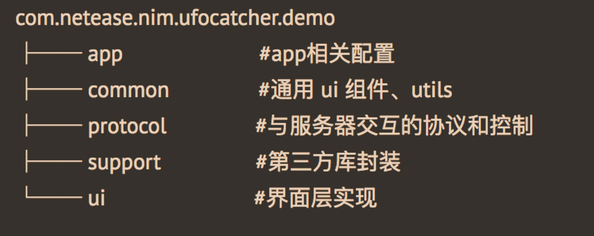
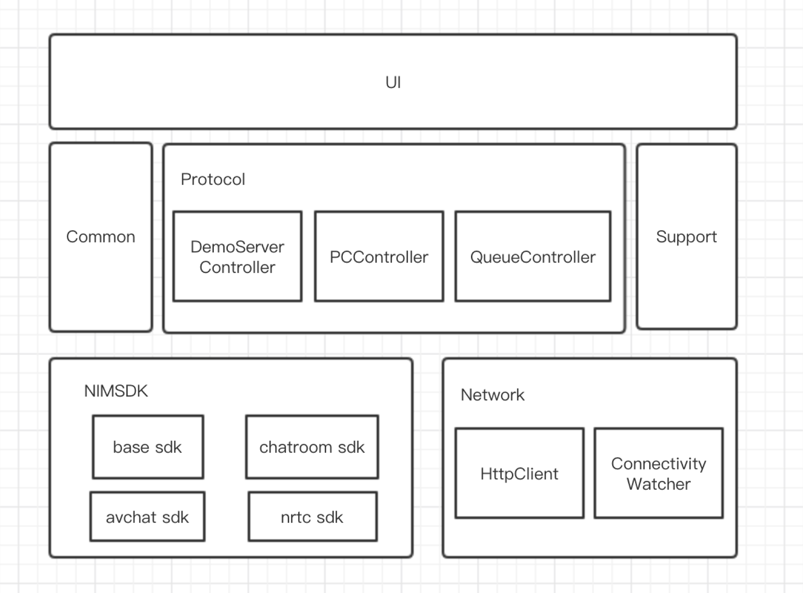

# 网易云信在线抓娃娃 Android 实现说明

## 一、	终端整体逻辑介绍

游戏场景中分为两种角色：`普通观众`和`游戏玩家`。

观看抓娃娃画面根据角色的不同，使用不同的实现方法。普通观众使用直播拉流的方式，通过拉流画面观看抓娃娃。游戏玩家使用实时音视频的方法，通过实时音视频画面观看抓娃娃。

普通观众的拉流模式切换为游戏玩家的实时音视频方法，需要通过以下几个步骤进行：

1、首先显示拉流画面，预约排队，预约成功后会进入排队队列，等待排队通知。

2、当排队轮到你时，PC 发起音视频通话请求。

3、若点击开始游戏，则接受 PC 的音视频通话请求。若超过 10s，没有点击开始游戏，表示放弃游戏，自动挂断 PC 的音视频通话请求。

4、当双方音视频通话请求建立，则显示音视频画面，隐藏拉流画面，并可进行游戏。

5、当点击 GO 或者达到 30s 游戏超时时间，会发送 GO 指令给 PC，并等待 PC 的挂断通知。

6、收到 PC 的挂断通知或 20s 内无法收到挂断通知，则退出音视频频道，显示拉流画面。

## 二、	娃娃机场景重难点实现

### 1、	远程控制指令的实现

远程控制指令有`上下左右四个方向指令`，`GO下爪指令`，以及`摄像头切换指令`。

Android 端控制指令由 PCController 来实现，控制指令的使用说明如下。

**1)	初始化**

在 onCreate 时，初始化 PCController 对象，并调用 init 方法。

**2)	控制指令创建**

需要注意的是，由于有两个摄像头，所以上下左右四个方向需要根据摄像头的方向来发送相关指令，以下以 currentCamera 为例，表示 0 或者 1。以下方向控制指令为例：

```
String command = PCController.Builder.buildDownCommand(currentCamera);
```

**3)	控制指令的发送**

调用 sendCommandToPC 方法，发送控制指令，可设置回调查看指令发送结果。

**4)	监听抓娃娃的结果**

在初始化 oncreate 中，注册游戏结果事件通知 observePCNotification。根据通知中包含的 PCNotification#getCommand 获取抓娃娃结果。PCNotification. COMMAND_GAME_OVER_RESULT_SUCCESS 表示抓取成功，PCNotification. COMMAND_GAME_OVER_RESULT_FAILED 表示抓取失败。

**5)	监听控制指令的释放**

注意：需要在 Activity 的 ondestroy 中，添加 PCNotification#ondestroy，注销控制指令的监听。

### 2、	排队场景的实现

Android 端排队场景由 QueueController 来实现。QueueController 包含`初始化队列控制`，`开始排队`，`取消排队`，`监听队列变化`，`注销队列控制`。

**1)	初始化队列控制**

首先需要监听聊天室登录状态 observeOnlineStatus，在监听中进行初始化。保证首次登录或者断网重连时，初始化队列。

**2)	开始排队**

使用 QueueController#addQueue 方法来排队。

**3)	取消排队**

使用 QueueController#cancelQueue 方法来取消排队。

**4)	监听队列变化**

在 oncreate 中，注册队列变化监听，调用 QueueController #observeQueueChange 进行监听。可在观察者中获取 QueueInfo，包含正在玩游戏的玩家帐号，昵称，排队个数，自己是否在队列中的信息。

**5)	注销队列控制**

调用 QueueController#ondestroy 方法，注册队列控制。注意：在注销之前，先发送 cancelQueue 取消排队，然后在进行队列控制的注销操作。

### 3、	观众观看场景（直播拉流）的实现

一进入房间，即开始两路拉流，同时拉两个摄像头的画面，界面上仅显示一个摄像头画面。

播放器开启推流步骤如下：

**1)**	初始化推流布局，在布局文件中设置 NEVideoView，例如命名为 videoView，初始化 videoView，设置 videoView.getRenderViewLayoutParams()。

**2)**	初始化一个 VideoPlayer 对象，传入拉流视图，拉流 url 等参数。

**3)**	使用 VideoPlayer#openVideo 方法，开始拉流。

**4)**	调用 PlayerActivity#showRTMPVideo(boolean front) 方法，设置显示前后摄像头。front 为 true 表示前置摄像头，为 false 表示后置摄像头。

播放器前后台切换及断网重连策略：

**1)**	App 退后台，不停流，由 Service 保持拉流。

**2)**	网络断开，立即停流。

**3)**	在网络恢复、App 回到前台时尝试恢复拉流。

**4)**	尝试拉流：必须在网络可用 && App 在前台 && 没有被停流 三个条件都符合时才重新初始化流。

### 4、	游戏者上机（实时音视频）的实现

当观众排队轮到自己时，开始实时音视频连接。实时音视频连接步骤：

**1)**  需要在 oncreate 中，注册多个监听。

 - 注册音视频来电监听
 - 注册音视频通话状态监听
 - 注册音视频通话对方挂断通知

**2)**  监听到 PC 发起的音视频来电，在观察者中，初始化音视频，并开启开始游戏 10s 倒计时。

**3)**  点击开始游戏之后，调用 AVChatManager#accept2，同意与 PC 建议音视频连接。若超过 10s，未点击开始游戏，则调用 AVChatManager#hangUp2 放弃游戏。

**4)**  当收到音视频通话状态监听的 onUserJoined 时，显示音视频画面。

**5)**  当游戏结束，收到音视频通话对方挂断通知后，结束音视频画面显示。

## 三、	Demo源码导读

### 工程说明

Android 娃娃机 Demo 工程基于以下开发

1、	网易云信 basesdk，avchat，chatroom 和 nrtc，版本为 4.4.0

2、	播放器 NELivePlayer，版本为 1.3.1

3、	日志库 nim_log，版本为 1.3.0

4、	View 注入 Butter Knife，版本为 8.8.1

5、	图片加载库 Glide，版本为 4.2.0

6、  JDK 使用 1.8.0

### 工程结构

#### 目录结构



#### 总体结构



#### 详细说明

- 模块说明

**app模块** 定义了 App 相关配置，提供了用户登录信息以及崩溃日志等。

**common模块** 定义了通用 UI 组件和工具类，包含界面的基类定义，使用到的 RecyclerView，Dialog 以及其他通用工具类。

**protocol 模块** 定义了与服务器交互的协议。主要有应用服务器客户端，与 PC 交互指令的控制器以及聊天室队列控制器。

**support 模块** 定义了第三方库封装。包含了播放器的封装，音视频的封装以及权限控制的封装。

**ui 模块** 是主要的界面层实现。MainActivity 包含了聊天室列表。PlayerActivity 是抓娃娃页面。

- 主要类说明

**WelcomeActivity：**  从云信服务器获取登录信息，登录云信 SDK。

**MainActivity：**  聊天室列表

**PlayerActivityBase：**  封装所有 UI 控件的获取及基本聊天组件。

**PlayerActivity：**  游戏主流程控制。

**DemoServerController：**  网易云信 Demo Http 客户端，提供了请求帐号信息和获取聊天室列表的接口。

**PCController：**  与 PC 机器交互指令的控制器，用于切换 PC 客户端的推流的视频采集设备及下发 PC 机器抓娃娃指令。

**QueueController：**   聊天室队列控制器，用于控制抓娃娃的排队人数和排队顺序。

### 主要接口说明

#### 应用服务器接口

##### 请求帐号信息

```
public void fetchLoginInfo(final IHttpCallback<TouristLoginInfo> callback)
```

- 参数说明

TouristLoginInfo 说明：

|TouristLoginInfo 接口|说明|
|:---|:---|
|getAccount()|获取用户帐号|
|getToken()|获取用户密码|
|getNickname()|获取用户昵称|

#### 获取聊天室列表

```
public void fetchRoomList(final IHttpCallback<List<RoomInfo>> callback)
```

- 参数说明

|RoomInfo 接口|说明|
|:---|:---|
|getRoomId()|获取聊天室id|
|getName()|获取聊天室名称|
|getCreator()|获取聊天室创建者|
|getRtmpPullUrl1()|获取拉流地址1|
|getRtmpPullUrl2()|获取拉流地址2|
|getLiveStatus()|获取直播状态|
|isRoomStatus()|获取房间是否有效状态|
|getOnlineUserCount()|获取在线人数|
|getQueueCount()|获取排队人数|

### 控制指令

#### 控制指令初始化

```
public void init(String pcAccount)
```

- 参数说明

|参数|说明|
|:---|:---|
|pcAccount|控制娃娃机的pc端帐号|

#### 发送控制指令

```
public void sendCommandToPC(String command, RequestCallbackWrapper<Void> callback) 
```
- 参数说明

|参数|说明|
|:---|:---|
|command|控制指令，详见PCController.Builder|
|callback|发送控制指令的回调函数|

PCController.Builder 说明

|接口|说明|
|:---|:---|
|buildUPCommand(int cameraId)|上方向指令，cameraId表示画面源(0/1取值)|
|buildDownCommand(int cameraId)|下方向指令，cameraId表示画面源(0/1取值)|
|buildLeftCommand(int cameraId)|左方向指令，cameraId表示画面源(0/1取值)|
|buildRightCommand(int cameraId)|右方向指令，cameraId表示画面源(0/1取值)|
|buildFuckCommand()|go指令，表示下爪抓娃娃|
|buildSwitchToCamera1()|切换到画面源1|
|buildSwitchToCamera2()|切换到画面源2|

- 参数说明

#### 监听游戏结果事件

```
public void observePCNotification(Observer<PCNotification> observer, boolean register)
```

- 参数说明

PCNotification 参数说明

|PCNotification 参数|说明|
|:---|:---|
|getCommand()|获取游戏结果|
|COMMAND_GAME_OVER_RESULT_SUCCESS|常量，表示抓取娃娃成功|
|COMMAND_GAME_OVER_RESULT_FAILED|常量，表示抓取娃娃失败|

### 队列控制

#### 队列初始化

```
public void init(final String roomId)
```

- 参数说明

|参数|说明|
|:---|:---|
|roomId|聊天室id|

#### 监听队列变化

```
public void observeQueueChange(Observer<QueueInfo> observer, boolean register)
```

- 参数说明

QueueInfo 说明：

|QueueInfo 参数|说明|
|:---|:---|
|getFirstItemAccount()|正在玩游戏的玩家帐号|
|getFirstItemNickname()|正在玩游戏的玩家昵称|
|getWaitingCount()|队列中正在排队人数|
|isSelfInQueue()|自己是否在队列中|

